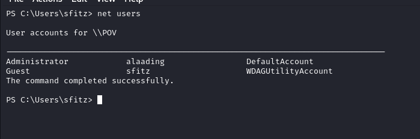
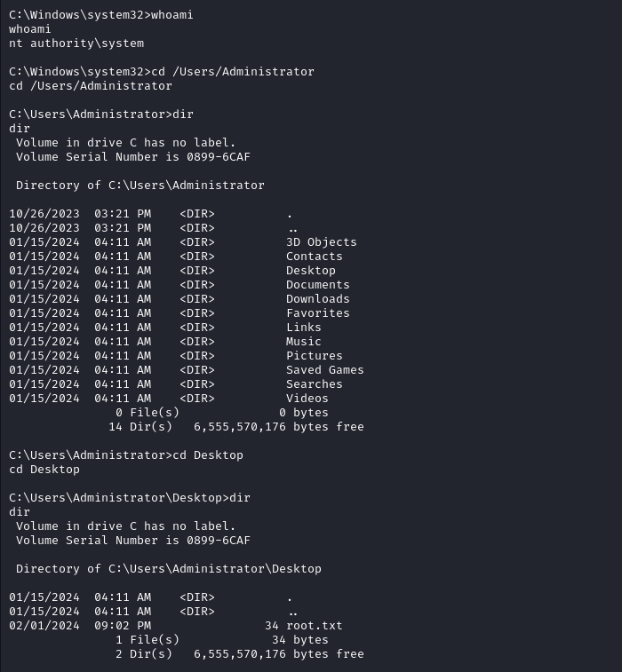

# HackTheBox POV

## RECON

### Nmap

Starting of with the NMAP, It shows  only one port open 80/(http).

Going through Script and version scan it shows something like a hostname in http_title

Adding hostname in to our /etc/hosts file

## Website

### pov.htb

Going through the webpage looks like a static webpage leaking another hostname dev.pov.htb and potential user sfitz.

Adding the hostname dev.pov.htb

### dev.pov.htb

Looking in to the site we can see there is a download button to Download Stephen Fitz CV

* * *

### User Sfitz

Intercepting the Download Request through burp it looks something like this with the file parameter as cv.pdf 

Seding the Request in to the Repeater and changing the cv.pdf in index.aspx it gives error path to /portfolio/default.aspx

Changing the file parameter from index.aspx to default.aspx it shows code of the page means the file parameter is vulnerable to file_disclosure vulnerablity

It also shows index.aspx.cs as a CodeFile

Looking in to th index.aspx.cs file we can see it is filtering ../ for possible directory traversal attacks 

To bypass the filter we can do something like ....//web.config as it will filter out ../ and the req will be processed as ../web.config

We are looking in to web.config because sometimes it holds sensitive information.

Web.Config is leaking Decryption key and Machine key and since the site is using ViewState cookie There is a potential chance of RCE

There are few resources on the internet which goes over this like hacktricks, I personally liked this one [here](https://blog.liquidsec.net/2021/06/01/asp-net-cryptography-for-pentesters/) 

Using [ysoserial.exe](https://github.com/pwntester/ysoserial.net/releases/tag/v1.35) in windows VM to generate a RCE payload 

For simplicity i used powershell base64 encoded payload

Pasting the resulted payload ysoserial gave us in to the ViewState parameter on the burp

modifying our nishang revshell payload 

Starting the python webserver in and nc in our box and sending the request we get the shell back 

Using whoami we can see we go the shell as sfitz user

* * *

### User alaading

Starting Recon of the Box as Sftiz we can see there is another user on the box as alaading

Looking at the current open ports in the box we can see the smb (445), winrm(5985) ports are open locally

Enumerating sftiz home directory we found connection.xml file in the Documents Directory

Looking in to the contents of the file there is what looks like a secure string pass of user alaading

To Decrypt the Secure string pass we put the pass in to the file.

Decrypting the pass we get the Password for user alaading

Since there is no way we can log in to the box from our box as only port 80 is open to us. But winrm is open locally so we can use Chisel to access the port

Starting chisel server in our box 

Putting Chisel in windows and doing port forwarding of winrm

We can see port 5985 is opened in our box

Using Evil-Winrm to log in as User alaading we can login in to box

We can grab the user.txt 

* * *

### Privilege Escalation To System

whoami /priv shows us that the use alaading has SeDebugPrivilege Enabled

SeDebugPrivilege allows the holder to debug another process, this includes reading and writing to that process memory

To Use it for our advantage i used a powershell script from the [GITHUB](https://github.com/decoder-it/psgetsystem)

Moving it in to the box and then importing it 

Looking in to script it gave us the instruction on how to use it

We need a system process pid so i am using winlogon 

As a command to execute i am going to execute msfvenom revshell payload for windows.

Generating msfvenom payload

copying payload to the Box and Starting our nc listener we can use the powershell script module 

We Get the shell back as nt authority/system now we can grab the flag

* * *

